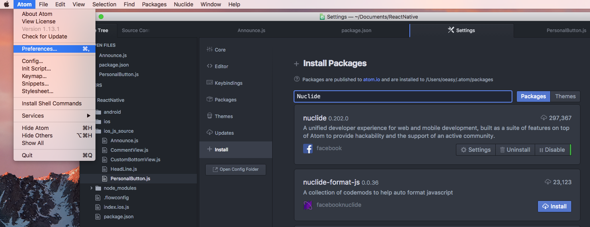
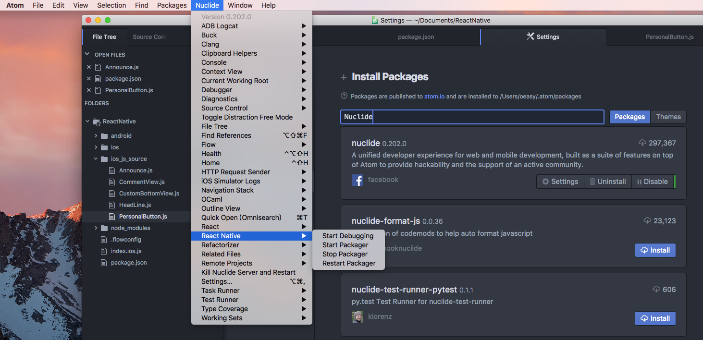
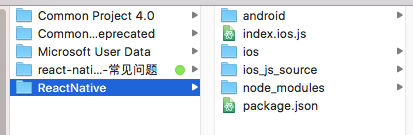
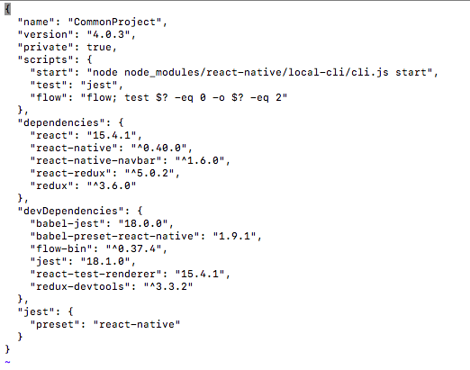
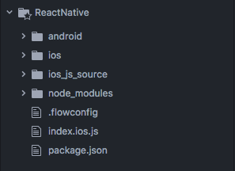
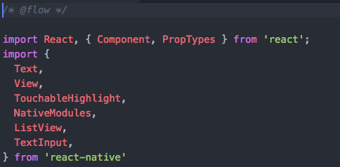
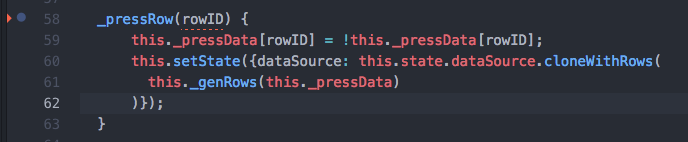
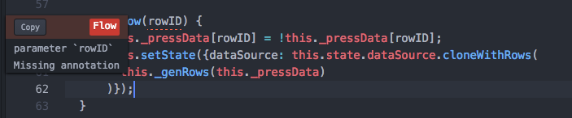
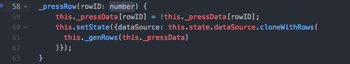
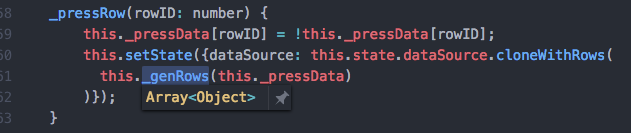

# react-native-
iOS集成react native时遇到的常见的问题列表

The frequently encountered problems in integrating React Native with existing iOS project

目标观众：OC程序员，但不了解或对JS了解很少

Target Audiences: OC Programmers, but only have a superficial knowledge about JS and React Native

# Server Side Problems

## Server Environment Setup

我们已知，运行的iOS应用从远端服务器端下载js bundle，所以在开发阶段，我们通常需要一个本地的服务器代替远端服务器来服务运行在Mac上的仿真机或iPhone上的应用。

React Native采用Node.js作为服务器容器，所以在Mac上我们应该安装npm（node package manager）.这个工具负责了node服务器的启动、关闭，第三方库、依赖的管理，脚本命令的执行等等。

打开一个终端，输入
```
    brew install node 
    brew install watchman
```
node安装完成，继续输入
```
    npm install -g react-native-cli
```

这个命令安装了react native 命令接口，-g参数是必须的，这保证了该接口对Mac上的所有react native项目可用。

As we already know, the running iOS app downloads JS bundle from remote server, so in development phase, we need a local server to serve the app which is running on the Mac  (e.g simulator) or on the iPhone.

React Native adpots Node.js as the server container, so on Mac we should install npm (node package manager), which is responsible for the server startup and shotdown, third party libraries and dependencies installation and removement, script command execution and so on.


open a Terminal, we input

```
    brew install node 
    brew install watchman
```

After node is installed, we tap below command in Terminal
```
    npm install -g react-native-cli
```

this command installs react native client command line interface, the -g argument is indispensable, which guarantees that the react native cli is available for all react native projects on the Mac.

more details please reference: https://facebook.github.io/react-native/docs/getting-started.html#content

## JS Editor installation

Facebook为编辑器Atom发布了一款名为Nuclide的插件，这不是必须的，但强烈建议iOS开发者安装，Nuclide包含了React Native相关功能和Facebook自己为js添加的类型检查（通过flow），使用flow后，所有的js代码必须显式加上类型。  

要下载Atom编辑器，请访问https://atom.io/  

Atom安装后，启动，进入Atom->Preferences...->Install菜单项，输入Nuclide，来自Facebook的第三方包即是，我们按照它。  

重启Atom之后，我们就可以在Atom的工具栏中看到Nuclide菜单，如下两图所示。  

Facebook launched a great plugin Nuclide for the charming editor Atom, this is optional, but I strongly recommend iOS developers to use this editor and its plugin, because in Nuclide Facebook play an additional type checking on JS code (flow), when using flow, all code in JS must add type explicitly.  


To download Atom, please reference: https://atom.io/  


After Atom is installed, we launch it, go to Atom->Preferences...->Install and tap Nuclide in the search box, the top 1 result is from facebook, and we install it.  




Now, we restart it, we can see additional Nuclide entry on the tool bar of atom.


## Project Integrating

通常我们已有一个iOS项目，所以我们不会创建一个新的react native项目，而是把已有的iOS项目集成到React Native目录中（同样过程也适用于Android）

一个React Native项目目录如下图所示：  

It's not rare to have an existing project, so instead of creating a total new React Native project, we should add existing iOS project to React Native folder(same process apply to Android)  

A React Native Project looks like below:



在ios目录中，我们存放了已有的iOS项目（android目录则存放android项目）  

index.ios.js是iOS项目的js入口代码（android则为index.android.js）  

这里，我们需要特别关注package.json文件和node_modules目录  

我们并不自己创建node_modules目录，而是npm根据package.json中指定的依赖去下载JS和OC代码并存放在这个目录里。

我们编辑package.json文件，一个package.json文件通常如下图所示：

In ios folder, we store our existing iOS project(android folder for storing android project)  

index.ios.js is the entrance file of our js code for iOS(the counterpart file for Android is index.android.js)  

Here we should pay special attention to package.json and node_modules folder.  

We don't create node_modules folder, instead npm install necessary JS and OC code for us into this folder.  

We edit package.json, an ordinary package.json looks like below:  

  

这里name指定了我们的项目名字（可以参考iOS项目的名称）

version指定了项目的版本（可以参考iOS项目的版本）

scripts指定了长命令的缩写，由npm调用

例如，

终端中，我们输入

in Terminal, we tap  
```
    npm start
```

会被npm替换为
```
    node node_modules/react-native/local-cli/cli.js start
```

在dependencies区域，我们指定了所使用的react和react native的版本（15.4.1和0.40.0）  

name specify our project name(refer to the project name in info.plist of Xcode)  

version specify the version of the project (refer to the version value in info.plist of Xcode)

scripts specify the abbreviation of the long command, which will be called by npm

e.g 

in Terminal, we tap  
```
    npm start
```

which will be substituted by  
```
    node node_modules/react-native/local-cli/cli.js start
```

in dependencies section, we specify the version of react(15.4.1) and react native(0.40.0) we use


# Atom Problems

## flow problems

How to use flow to type check?

First off, we should create a blank .flowconfig in the root folder

After .flowconfig file is created and put in the root folder, the hierarchy looks like below:  




And in every JS file we want flow to type check, we add /* @flow */ at the top of the file:  


After that, flow will check our js code automatically, if not, restart Atom.

If we don't add type annotation to the arguments and return type, flow will alert us like below:  





After we add enough annotation, the alert goes away:  



Now when we call method will flow annotation, we can get method arguments type prompt.  


More syntax detail about flow, please refer https://flowtype.org/


# JS Problems


# OC Problems


