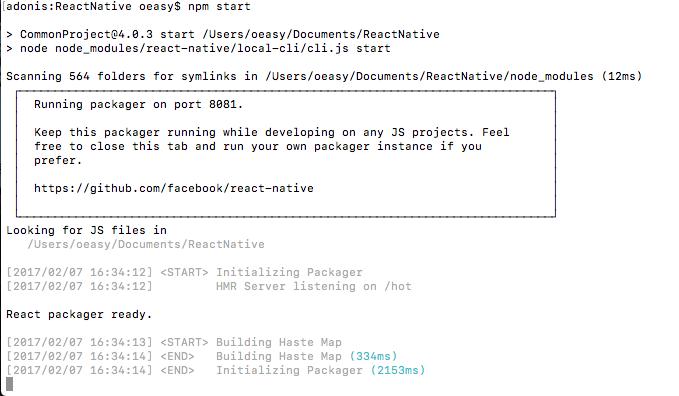

# react-native-
iOS集成react native时遇到的常见的问题列表

The frequently encountered problems in integrating React Native with existing iOS project

目标观众：OC程序员，但不了解或对JS了解很少

Target Audiences: OC Programmers, but only have a superficial knowledge about JS and React Native

# Server Side Problems

## Server Environment Setup

我们已知，运行的iOS应用从远端服务器端下载js bundle，所以在开发阶段，我们通常需要一个本地的服务器代替远端服务器来服务运行在Mac上的仿真机或iPhone上的应用。

React Native采用Node.js作为服务器容器，所以在Mac上我们应该安装npm（node package manager）.这个工具负责了node服务器的启动、关闭，第三方库、依赖的管理，脚本命令的执行等等。

打开一个终端，输入
```
    brew install node 
    brew install watchman
```
node安装完成，继续输入
```
    npm install -g react-native-cli
```

这个命令安装了react native 命令接口，-g参数是必须的，这保证了该接口对Mac上的所有react native项目可用。  

更多详情请参见：[react native](https://facebook.github.io/react-native/docs/getting-started.html#content)   

As we already know, the running iOS app downloads JS bundle from remote server, so in development phase, we need a local server to serve the app which is running on the Mac  (e.g simulator) or on the iPhone.

React Native adpots Node.js as the server container, so on Mac we should install npm (node package manager), which is responsible for the server startup and shotdown, third party libraries and dependencies installation and removement, script command execution and so on.


open a Terminal, we input

```
    brew install node 
    brew install watchman
```

After node is installed, we tap below command in Terminal
```
    npm install -g react-native-cli
```

this command installs react native client command line interface, the -g argument is indispensable, which guarantees that the react native cli is available for all react native projects on the Mac.

more details please reference: [react native](https://facebook.github.io/react-native/docs/getting-started.html#content)  

## JS Editor installation

Facebook为编辑器Atom发布了一款名为Nuclide的插件，这不是必须的，但强烈建议iOS开发者安装，Nuclide包含了React Native相关功能和Facebook自己为js添加的类型检查（通过flow），使用flow后，所有的js代码必须显式加上类型。  

要下载Atom编辑器，请访问[Atom](https://atom.io/)  

Atom安装后，启动，进入Atom->Preferences...->Install菜单项，输入Nuclide，来自Facebook的第三方包即是，我们按照它。  

重启Atom之后，我们就可以在Atom的工具栏中看到Nuclide菜单，如下两图所示。  

Facebook launched a great plugin Nuclide for the charming editor Atom, this is optional, but I strongly recommend iOS developers to use this editor and its plugin, because in Nuclide Facebook play an additional type checking on JS code (flow), when using flow, all code in JS must add type explicitly.  


To download Atom, please reference: [Atom](https://atom.io/)  


After Atom is installed, we launch it, go to Atom->Preferences...->Install and tap Nuclide in the search box, the top 1 result is from facebook, and we install it.  


Now, we restart it, we can see additional Nuclide entry on the tool bar of atom.


## Project Integrating

通常我们已有一个iOS项目，所以我们不会创建一个新的react native项目，而是把已有的iOS项目集成到React Native目录中（同样过程也适用于Android）

一个React Native项目目录如下图所示：  

It's not rare to have an existing project, so instead of creating a total new React Native project, we should add existing iOS project to React Native folder(same process apply to Android)  

A React Native Project looks like below:


在ios目录中，我们存放了已有的iOS项目（android目录则存放android项目）  

index.ios.js是iOS项目的js入口代码（android则为index.android.js）  

这里，我们需要特别关注package.json文件和node_modules目录  

我们并不自己创建node_modules目录，而是npm根据package.json中指定的依赖去下载JS和OC代码并存放在这个目录里。

我们编辑package.json文件，一个package.json文件通常如下图所示：

In ios folder, we store our existing iOS project(android folder for storing android project)  

index.ios.js is the entrance file of our js code for iOS(the counterpart file for Android is index.android.js)  

Here we should pay special attention to package.json and node_modules folder.  

We don't create node_modules folder, instead npm install necessary JS and OC code for us into this folder.  

We edit package.json, an ordinary package.json looks like below:  

  

这里name指定了我们的项目名字（可以参考iOS项目的名称）

version指定了项目的版本（可以参考iOS项目的版本）

scripts指定了长命令的缩写，由npm调用

例如，

终端中，我们输入

in Terminal, we tap  
```
    npm start
```

会被npm替换为
```
    node node_modules/react-native/local-cli/cli.js start
```

在dependencies区域，我们指定了所使用的react和react native的版本（15.4.1和0.40.0）  

name specify our project name(refer to the project name in info.plist of Xcode)  

version specify the version of the project (refer to the version value in info.plist of Xcode)

scripts specify the abbreviation of the long command, which will be called by npm

e.g 

in Terminal, we tap  
```
    npm start
```

which will be substituted by  
```
    node node_modules/react-native/local-cli/cli.js start
```

in dependencies section, we specify the version of react(15.4.1) and react native(0.40.0) we use


# Atom Problems

## flow problems

如何使用flow进行类型检查？

首先，我们需要在根目录下创建一个空白的.flowconfig文件，整个根目录如下所示：  


How to use flow to type check?

First off, we should create a blank .flowconfig in the root folder

After .flowconfig file is created and put in the root folder, the hierarchy looks like below:  


然后我们在每个我们想要flow进行类型检查的JS文件中，添加/* @flow */到文件顶部：  

And in every JS file we want flow to type check, we add /* @flow */ at the top of the file:  


之后，flow会自动检查我们的代码，如果没有，重启Atom  

此时，如果我们没有对函数的参数和返回值添加类型注释，flow会警告我们，如下：  

After that, flow will check our js code automatically, if not, restart Atom.

If we don't add type annotations to the arguments and return type, flow will alert us like below:  


在我们添加了足够的注释后，警告消失：  

After we add enough annotations, the alert goes away:  


现在当我们调用有flow注释的方法时，我们可以得到参数类型提示：  


Now when we call method with flow annotations, we can get method arguments type prompt.  


更多关于flow的语法细节，请访问[flow](https://flowtype.org/)  

More syntax detail about flow, please refer [flow](https://flowtype.org/)  

## duplicate server start

In ordinary, we have two ways to start local server:  

in Terminal, we go to the root folder of React Native, and tap:  
```
    npm start
```
 
   

or  

in Atom editor, we go to Atom->Nuclide->React Native->start packager  
  

These two ways are interchangeable, but we can't call them at the same time, otherwise we will get an alert, which tell us the port 8081 has been taken up by another process.  
   

The solution is simple, we just find the process and kill it:  
```
    lsof -i : 8081
    kill -9 <PID>
```

The first command find the process for us, and in the second command we kill the corresponding process.  
   

Now we can restart the server.

# JS Problems

对OC程序员来说，JS看起来就像一场噩梦。 JS不是强类型语言，我们也不知道该遵从哪个规范。  

To OC programmers, JS looks like a nightmare. JS is not a strong type language, we don't know to which specificaiton confrom, ES5 or ES6? etc.

## type check

如前所述，虽然JS不是强类型语音，但是Facebook为我们这些来自C语言家族的程序员一个附加功能，flow，去显式声明JS函数的参数类型，返回类型。  

隐式变量类型并不意味JS没有类型，它只是选择向我们隐藏类型信息，但它自己会从变量推断类型信息，每个函数调用者都应该了解该函数的参数类型、返回类型，所以Facebook为我们提供了类型注释。没有它，JS代码易于引入因参数不匹配而产生的bug，也不易于调试。通过它，我们也无需翻阅要调用的函数代码去确定传入参数的类型，这为我们节省了不少时间。  
所以再一次，我强烈建议所以JS新人都采用flow。  

As we already see above, although JS is not a strong type language, Facebook provide us, C-like language programmers, an additional functionality, flow, to explicitly declare the type of the parameters, return type of JS function.  

implicit variable type doesn't mean JS doesn't have types, JS just choose to hide the type from us, and infer the type info by itself, every function caller should know the parameters' type and return type of the function, so Facebook add type annotation for us.  Otherwise, the JS code are prone to bugs introduced by mismatched input parameters and are not so easy to debug.  By leveraging flow, we don't have to reference the source code of the callee to make sure the right parameter type, this save us a lot of time.

So once again, I strongly recommend all freshmen to JS to adopt flow.

## ES5 vs ES6

在React Native或其他网站，我们经常遇到以下两种方式的JS代码

ES5
```
    var React = require('react-native');
    var { TabBarIOS, NavigatorIOS } = React;

    var App = React.createClass({
        render: function() {
            return (
                <TabBarIOS>
                <TabBarIOS.Item title="React Native" selected={true}>
                <NavigatorIOS initialRoute={{ title: 'React Native' }} />
                </TabBarIOS.Item>
                </TabBarIOS>
            );
        },
    });
``` 

ES6
```
    import React, {Component} from 'react';
    import { AppRegistry , requireNativeComponent} from 'react-native';

    var RCTPersonalButton = requireNativeComponent('RCTPersonalButton', PersonalButton);

    export class PersonalButton extends Component {
        render() {
        return <RCTPersonalButton {...this.props} />;
    }
    }

    PersonalButton.propTypes = {
    // An allowable property example, all properties declared here can be referenced automatically
        title: React.PropTypes.array,
        titleColor: React.PropTypes.array,
        image: React.PropTypes.array,
        font: React.PropTypes.number,
    };
```  


更多ES5和ES6的详细对比，可以参看[ES5 VS ES6](http://blog.techbridge.cc/2016/04/04/react-react-native-es5-es6-cheat-sheet/) （可能需要科学上网） 和[ES6 特性(英文)](https://babeljs.io/learn-es2015/)
那么哪种编程规范是我们该采用的呢？

从0.23.0开始，React Native放弃了ES5而采用了ES6，所以任何新的React Native程序员都应该使用ES6而不是ES5。

In React Native website or any other websites, we often come across below code with two different styles.

ES5
```
    var React = require('react-native');
    var { TabBarIOS, NavigatorIOS } = React;

    var App = React.createClass({
        render: function() {
            return (
                <TabBarIOS>
                <TabBarIOS.Item title="React Native" selected={true}>
                <NavigatorIOS initialRoute={{ title: 'React Native' }} />
                </TabBarIOS.Item>
                </TabBarIOS>
            );
        },
    });
``` 

ES6
```
    import React, {Component} from 'react';
    import { AppRegistry , requireNativeComponent} from 'react-native';

    var RCTPersonalButton = requireNativeComponent('RCTPersonalButton', PersonalButton);

    export class PersonalButton extends Component {
        render() {
        return <RCTPersonalButton {...this.props} />;
    }
    }

    PersonalButton.propTypes = {
    // An allowable property example, all properties declared here can be referenced automatically
        title: React.PropTypes.array,
        titleColor: React.PropTypes.array,
        image: React.PropTypes.array,
        font: React.PropTypes.number,
    };
```  
 
more detail please see: [ES5 VS ES6](http://es6-features.org)和[ES6 features](https://babeljs.io/learn-es2015/)  

So which specification should we choose?  

Since 0.23.0, React Native abandoned the old ES5 and adopted ES6, every new React Native programmer should embrace ES6 rather than ES5.  


## React 

### props

### state

### flex

### redux

Why we need redux?

更多细节请参考 [redux](http://redux.js.org/)  

需要注意，要安装redux，我们可以如下将之在我们的package.json中引入：  

more detail, please refer to [redux](http://redux.js.org/)  

be careful, to install redux, we can include it in our package.json, like below:


或者我们可以在React Native的根目录下打开终端，输入以下命令:  

or we can run below command in our React Native root directory in Terminal
```
    npm install --save redux
    npm install --save react-redux
    npm install --save-dev redux-devtools
```

These two methods are equivalant, they all download redux and related packages and install them under {React Native Root Directory}/node_modules/  

这两种方法是等价的，他们都会下载redux和相关包并安装到{React Native Root Directory}/node_modules/下  


## this bind

## props pass

## state initialize

## required props

## network request

## debug

## infinite call stack

## how to import custom JS file

## export JS class

## ES5 vs ES6

## flex layout


# OC Problems

## export module(class)

## export method

## export properties

## export custom component (UIView)

## generate JS file and OC code automatically

## integrate third party library

Sometimes we need integrate third party libraries to speed up the development. 

For example, multiple Image Picker is one of the commonst required function demanded by apps. 

However, the official component couldn't meet our needs.  

So we choose to adopt [React Native Image Crop Picker](https://github.com/ivpusic/react-native-image-crop-picker)  

But when we build our iOS app, we encounter header file not found problem like below  :


有时，我们需要集成第三方库以加速我们的开发。 

例如，多图选择器是一个常见的业务需求功能。  

然而，官方的控件并不能满足我们的要求。

所以，我们打算采用 [React Native Image Crop Picker](https://github.com/ivpusic/react-native-image-crop-picker)  

但是当我们构建iOS应用的时候，却遇见了以下错误。 


经过一些抓破头皮的尝试后，我添加了两个新的xcconfig文件到imageCropPicker项目，如下 
After some digging, I add two xcconfig files to imageCropPicker project, like below  


The content of the xcconfig file looks like below  
xcconfig文件的内容如下 


Then I config the project setting's Configurations of Project->Info, like below  
接着我设置了imageCropPicker项目的Project->Info中的Configurations选项 


然后我设置了imageCropPicker的targets中Building Setting中的头文件的搜索路径为递归，如下  
And I set the header search path of imageCropPicker->target->Build Settings->Header Search Paths from non-recursive to recursive, like below  

 

After all these work, try build again, finnally the app run successfully.

Although we tackled this problem, but why did it not work at first?

Let's delve into the build logs of two different times.

The fail build log of ImageCropPicker.m looks like below 
ImageCropPicker.m文件的构建失败日志如下 

```
CompileC /Users/oeasy/Library/Developer/Xcode/DerivedData/CommonProject-cucrlakddhuvxzdbiiiifkujqojw/Build/Intermediates/imageCropPicker.build/Debug-iphonesimulator/imageCropPicker.build/Objects-normal/i386/ImageCropPicker-400F16F3CF62B860.o ImageCropPicker.m normal i386 objective-c com.apple.compilers.llvm.clang.1_0.compiler
cd /Users/oeasy/Documents/ReactNative/node_modules/react-native-image-crop-picker/ios
export LANG=en_US.US-ASCII
export PATH="/Applications/Xcode.app/Contents/Developer/Platforms/iPhoneSimulator.platform/Developer/usr/bin:/Applications/Xcode.app/Contents/Developer/usr/bin:/usr/local/bin:/usr/bin:/bin:/usr/sbin:/sbin"
/Applications/Xcode.app/Contents/Developer/Toolchains/XcodeDefault.xctoolchain/usr/bin/clang -x objective-c -arch i386 ... -I/Users/oeasy/Library/Developer/Xcode/DerivedData/CommonProject-cucrlakddhuvxzdbiiiifkujqojw/Build/Intermediates/imageCropPicker.build/Debug-iphonesimulator/imageCropPicker.build/imageCropPicker-all-non-framework-target-headers.hmap -ivfsoverlay /Users/oeasy/Library/Developer/Xcode/DerivedData/CommonProject-cucrlakddhuvxzdbiiiifkujqojw/Build/Intermediates/imageCropPicker.build/all-product-headers.yaml -iquote /Users/oeasy/Library/Developer/Xcode/DerivedData/CommonProject-cucrlakddhuvxzdbiiiifkujqojw/Build/Intermediates/imageCropPicker.build/Debug-iphonesimulator/imageCropPicker.build/imageCropPicker-project-headers.hmap -I/Users/oeasy/Library/Developer/Xcode/DerivedData/CommonProject-cucrlakddhuvxzdbiiiifkujqojw/Build/Products/Debug-iphonesimulator/include -I/Users/oeasy/Library/Developer/Xcode/DerivedData/CommonProject-cucrlakddhuvxzdbiiiifkujqojw/Build/Intermediates/imageCropPicker.build/Debug-iphonesimulator/imageCropPicker.build/DerivedSources/i386 -I/Users/oeasy/Library/Developer/Xcode/DerivedData/CommonProject-cucrlakddhuvxzdbiiiifkujqojw/Build/Intermediates/imageCropPicker.build/Debug-iphonesimulator/imageCropPicker.build/DerivedSources ... -c /Users/oeasy/Documents/ReactNative/node_modules/react-native-image-crop-picker/ios/ImageCropPicker.m -o /Users/oeasy/Library/Developer/Xcode/DerivedData/CommonProject-cucrlakddhuvxzdbiiiifkujqojw/Build/Intermediates/imageCropPicker.build/Debug-iphonesimulator/imageCropPicker.build/Objects-normal/i386/ImageCropPicker-400F16F3CF62B860.o

In file included from /Users/oeasy/Documents/ReactNative/node_modules/react-native-image-crop-picker/ios/ImageCropPicker.m:8:
/Users/oeasy/Documents/ReactNative/node_modules/react-native-image-crop-picker/ios/ImageCropPicker.h:17:9: fatal error: 'React/RCTBridgeModule.h' file not found
#import <React/RCTBridgeModule.h>
^
1 error generated.
```
The success build log of ImageCropPicker.m looks like below  
ImageCropPicker.m的构建成功日志如下  

```
CompileC /Users/oeasy/Library/Developer/Xcode/DerivedData/CommonProject-cucrlakddhuvxzdbiiiifkujqojw/Build/Intermediates/imageCropPicker.build/Debug-iphonesimulator/imageCropPicker.build/Objects-normal/i386/ImageCropPicker-400F16F3CF62B860.o ImageCropPicker.m normal i386 objective-c com.apple.compilers.llvm.clang.1_0.compiler
cd /Users/oeasy/Documents/ReactNative/node_modules/react-native-image-crop-picker/ios
export LANG=en_US.US-ASCII
export PATH="/Applications/Xcode.app/Contents/Developer/Platforms/iPhoneSimulator.platform/Developer/usr/bin:/Applications/Xcode.app/Contents/Developer/usr/bin:/usr/local/bin:/usr/bin:/bin:/usr/sbin:/sbin"
/Applications/Xcode.app/Contents/Developer/Toolchains/XcodeDefault.xctoolchain/usr/bin/clang -x objective-c -arch i386 ... -I/Users/oeasy/Library/Developer/Xcode/DerivedData/CommonProject-cucrlakddhuvxzdbiiiifkujqojw/Build/Intermediates/imageCropPicker.build/Debug-iphonesimulator/imageCropPicker.build/imageCropPicker-own-target-headers.hmap -I/Users/oeasy/Library/Developer/Xcode/DerivedData/CommonProject-cucrlakddhuvxzdbiiiifkujqojw/Build/Intermediates/imageCropPicker.build/Debug-iphonesimulator/imageCropPicker.build/imageCropPicker-all-non-framework-target-headers.hmap -ivfsoverlay /Users/oeasy/Library/Developer/Xcode/DerivedData/CommonProject-cucrlakddhuvxzdbiiiifkujqojw/Build/Intermediates/imageCropPicker.build/all-product-headers.yaml -iquote /Users/oeasy/Library/Developer/Xcode/DerivedData/CommonProject-cucrlakddhuvxzdbiiiifkujqojw/Build/Intermediates/imageCropPicker.build/Debug-iphonesimulator/imageCropPicker.build/imageCropPicker-project-headers.hmap -I/Users/oeasy/Library/Developer/Xcode/DerivedData/CommonProject-cucrlakddhuvxzdbiiiifkujqojw/Build/Products/Debug-iphonesimulator/include -I/Users/oeasy/Documents/ReactNative/node_modules/react-native-image-crop-picker/ios/../../../ios/Pods/Headers/Public -I/Users/oeasy/Documents/ReactNative/node_modules/react-native-image-crop-picker/ios/../../../ios/Pods/Headers/Public/React -I/Users/oeasy/Documents/ReactNative/node_modules/react-native-image-crop-picker/ios/../example/node_modules/react-native/React -I/Users/oeasy/Documents/ReactNative/node_modules/react-native-image-crop-picker/ios/../example/node_modules/react-native/Libraries/Image -I/Users/oeasy/Library/Developer/Xcode/DerivedData/CommonProject-cucrlakddhuvxzdbiiiifkujqojw/Build/Intermediates/imageCropPicker.build/Debug-iphonesimulator/imageCropPicker.build/DerivedSources/i386 -I/Users/oeasy/Library/Developer/Xcode/DerivedData/CommonProject-cucrlakddhuvxzdbiiiifkujqojw/Build/Intermediates/imageCropPicker.build/Debug-iphonesimulator/imageCropPicker.build/DerivedSources -F/Users/oeasy/Library/Developer/Xcode/DerivedData/CommonProject-cucrlakddhuvxzdbiiiifkujqojw/Build/Products/Debug-iphonesimulator ... -c /Users/oeasy/Documents/ReactNative/node_modules/react-native-image-crop-picker/ios/ImageCropPicker.m -o /Users/oeasy/Library/Developer/Xcode/DerivedData/CommonProject-cucrlakddhuvxzdbiiiifkujqojw/Build/Intermediates/imageCropPicker.build/Debug-iphonesimulator/imageCropPicker.build/Objects-normal/i386/ImageCropPicker-400F16F3CF62B860.o
```


在比较两个构建日之后，我们可以察觉到其中的细微差别 
After comparing the two logs, we could detect the subtle nuance between them. 

成功的日志多了一些头文件搜索路径  
The success log have additional header search paths like below 

```
-I/Users/oeasy/Documents/ReactNative/node_modules/react-native-image-crop-picker/ios/../../../ios/Pods/Headers/Public -I/Users/oeasy/Documents/ReactNative/node_modules/react-native-image-crop-picker/ios/../../../ios/Pods/Headers/Public/React -I/Users/oeasy/Documents/ReactNative/node_modules/react-native-image-crop-picker/ios/../example/node_modules/react-native/React -I/Users/oeasy/Documents/ReactNative/node_modules/react-native-image-crop-picker/ios/../example/node_modules/react-native/Libraries/Image
```

如我们所知头文件作为其他模块的入口，在编译时，编译器搜索头文件去定位其他类和方法的定义，在链接时，编译器会把所有而精致文件链接城一个可执行文件。 
As we all know header files function als the entry to other modules, at compiling time, compiler just search header files to locate the definitions of other classes and methods, at link time, compiler will link all object files into one big executable file. 

所以在哪存放、去哪查找头文件并不重要，因为他们并不存在于最终的二进制文件中。但是在编译时，它帮助单个.m文件去检查调用者是否遵循了定义规范。 
So it doesn't matter where to find and put the header files, because they don't exist in the final binary file. But at compile time, it help the single .m file to check that caller comform to the definition convention. 

